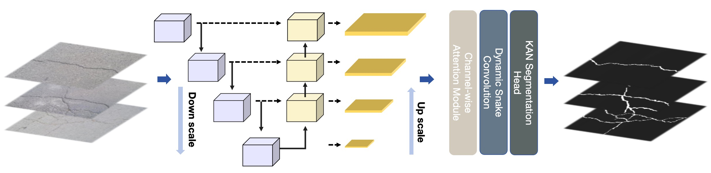
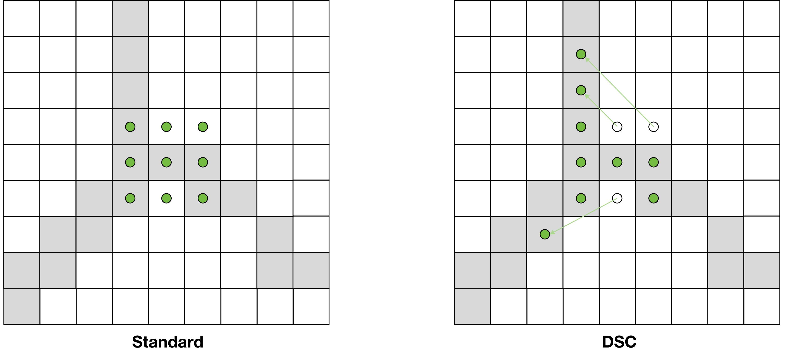
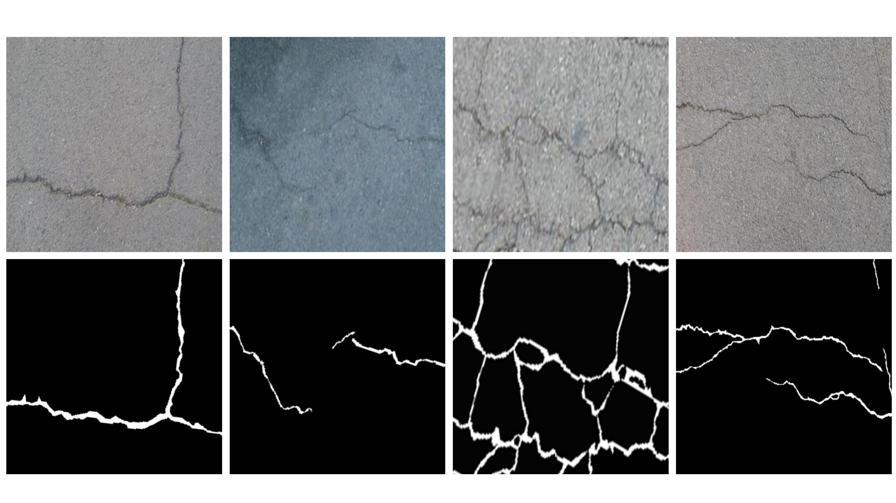
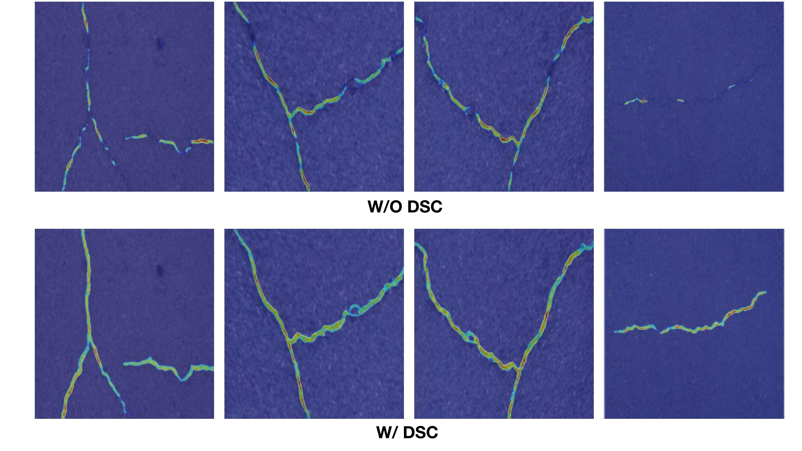
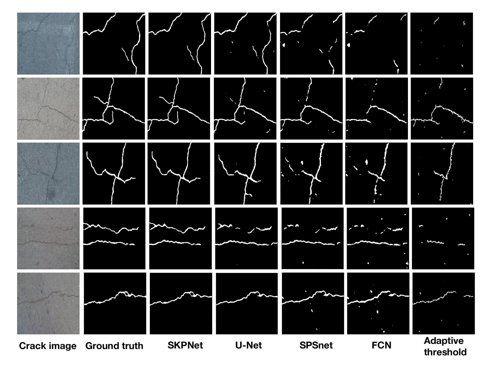

The main architecture of our method is illustrated in Figure.  The input first passes through a U-Net backbone to extract multi-scale features, which are then fused using a channel-wise self-attention module. Subsequently, information is further extracted via dynamic snake convolution with tubular offsets. Finally, the segmentation output is generated through a classification head composed of KAN layers.

In our bridge crack detection task, we introduce dynamic snake convolution [Qi et al., 2023] to improve boundary delineation and feature extraction. Given an input tensor $\mathbf{X} \in \mathbb{R}^{B \times C \times H \times W}$, where $B$ is the batch size, $C$ is the number of channels, and $H \times W$ represents the spatial dimensions, DSC dynamically adjusts the offsets of convolutional kernels based on the geometric properties of the cracks as shown in Figure. On the left is the standard convolution, and on the right is the dynamic snake convolution. The DSC with tubular offsets can pay more attention to the detailed information of tubular structures.

Additionally, Figure illustrates the visual results of our ablation study, specifically comparing the performance with and without the DSC module. The top row shows the crack detection results without the DSC module, where the cracks appear less continuous and more fragmented. In contrast, the bottom row demonstrates the results with the DSC module, where the cracks are detected with greater continuity and accuracy. These visual results corroborate the quantitative improvements shown in Table, highlighting the significant impact of the DSC module on enhancing crack detection performance.

